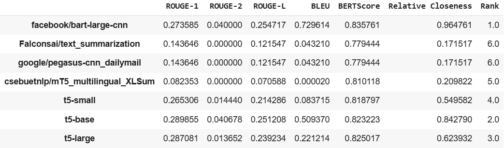
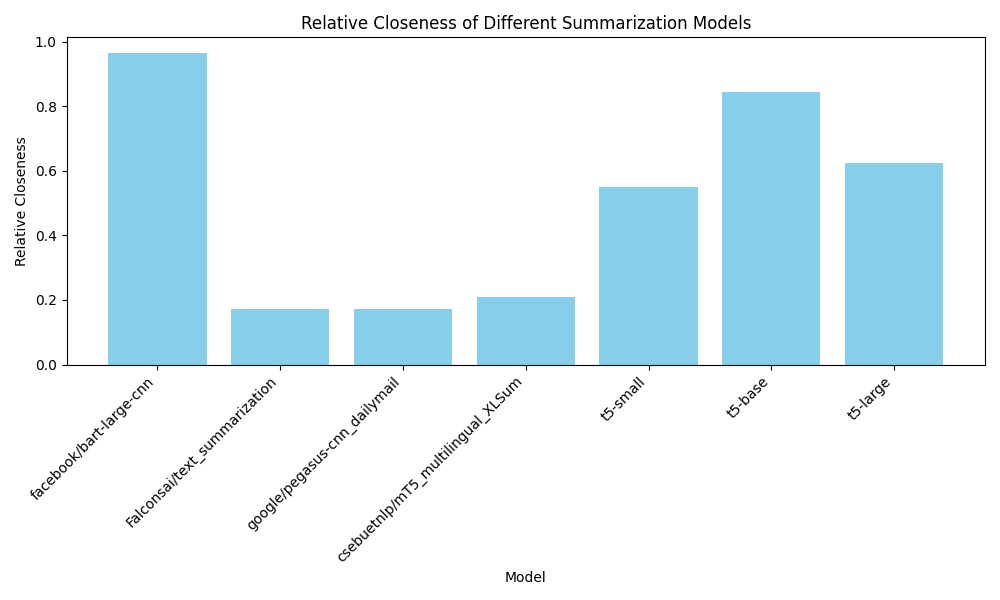

# Text Summarization Models - TOPSIS Evaluation

## Overview
This project implements **TOPSIS** (Technique for Order of Preference by Similarity to Ideal Solution) to evaluate and rank different pretrained text summarization models. The models are assessed based on standard evaluation metrics such as **ROUGE**, **BLEU**, and **BERTScore**, using the **PubMed Summarization** dataset.

---

## Dataset
- **Dataset Source**: [CCDV PubMed Summarization](https://huggingface.co/datasets/ccdv/pubmed-summarization)
- **Details**: 
  - Dataset provides scientific articles (`article`) and their corresponding summaries (`abstract`).
  - Extracted one example from the training set for testing:
    ```python
    dataset = load_dataset("ccdv/pubmed-summarization", "section")
    sample_text = dataset["train"][0]["article"]  # First article
    reference_summary = dataset["train"][0]["abstract"]  # Corresponding abstract
    ```
  - Example output:
    ```
    Sample Text:
    [First few lines of the article...]
    
    Reference Summary:
    [Corresponding abstract...]
    ```

---

## Models Evaluated
The following pretrained models were tested:
1. `facebook/bart-large-cnn`
2. `Falconsai/text_summarization`
3. `google/pegasus-cnn_dailymail`
4. `csebuetnlp/mT5_multilingual_XLSum`
5. `t5-small`
6. `t5-base`
7. `t5-large`

---

## Implementation Details
- **Truncation**: 
  - Input was truncated to a maximum length of 1024 tokens for efficient processing.
  ```python
  max_input_length = 1024
  sample_text_truncated = sample_text[:max_input_length]

## Metrics Used
1. **ROUGE** (Recall-Oriented Understudy for Gisting Evaluation):
   - ROUGE-1, ROUGE-2, and ROUGE-L measure similarity between generated and reference summaries.
2. **BLEU** (Bilingual Evaluation Understudy):
   - Evaluates the precision of generated summaries compared to references.
3. **BERTScore**:
   - Uses contextual embeddings to measure semantic similarity.
4. **TOPSIS Score**:
   - A multi-criteria decision-making method used to rank models based on the above metrics.

---

## Results
The models were ranked based on the TOPSIS method, and the best-performing model was `facebook/bart-large-cnn`.



---

## Visualization


The bar chart above shows the relative closeness of different models as calculated using the TOPSIS method.

---

